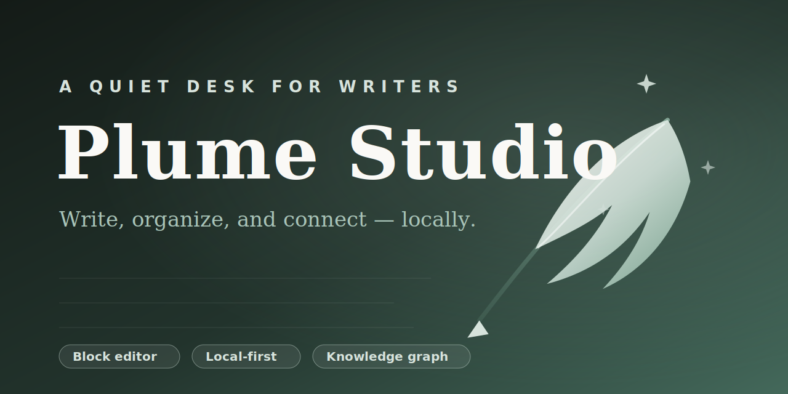

<p align="center">
  
</p>

# Plume Studio · 写作工作台

**Plume Studio** 是一个适合长期写作、整理内容和沉淀个人知识的现代化写作工作台。它完全运行在浏览器本地(IndexedDB),**不需要任何账号、服务器或 API**,打开即用。

- **在线使用**:<https://xuxuezhou.github.io/wechat-writing-studio/>(GitHub Pages,永久地址)
- 也可部署到 Vercel,或本地直接打开 `public/index.html` 同样可用

当前版本:`1.0.0`。

## 核心能力

### 写作
- **块级编辑器**——段落悬停出现拖拽手柄与 + 插入按钮;支持标题、引用、列表、待办、提示块、折叠内容、表格、代码块、数学公式、双栏布局
- **Markdown 快捷输入**(`# ` 标题、`- ` 列表、`> ` 引用、`---` 分割线等)与浮动格式工具栏
- **专注模式**——隐藏一切干扰,支持打字机滚动;自动保存 + 本地崩溃恢复 + 版本历史(可对比差异、恢复、命名版本)

### 图片与排版
- 拖拽 / 粘贴 / 批量上传;裁剪、旋转、圆角、边框、阴影、衬底
- 布局:居中、突出版心、全宽、左右浮动;双图 / 三图 / 网格 / 瀑布流 / 轮播 / 前后对比
- 图片标题、说明、来源、拍摄时间地点、Alt 文本
- **独立素材库**——按时间 / 文件夹 / 标签 / 使用情况筛选,查看图片被哪些文章引用,替换原图不破坏引用

### 内容组织
- **多级分类**(拖拽排序、图标、颜色、合并)+ 主分类 / 辅助分类
- **标签系统**(颜色、合并、使用统计、自动补全、批量打标)
- **合集与系列**(封面、章节、拖拽排序、完成进度、整体导出)
- **智能视图**——按状态 / 标签 / 字数 / 更新时间等组合筛选,保存到侧边栏
- 文章状态(灵感 → 草稿 → 写作中 → 待修改 → 已完成 → 已归档,可自定义)、优先级、截止日期、目标字数

### 思维星图(Knowledge Graph)
- 文章、分类、标签、合集、灵感的全屏可交互关系网络
- 正文输入 `[[文章标题]]` 建立**双向链接**,自动显示反向链接
- 八种关系类型(引用 / 延伸 / 前置阅读 / 补充 / 对比 / 反驳 / 同项目 / 自定义);拖节点到节点快速建立关系
- 五种布局:自由星图、分类聚类、时间轴、层级图、思维路径
- **思维路径**——为一组文章建立有方向的阅读 / 推理顺序,支持逐节点播放
- 聚焦模式(1 层 / 2 层 / 完整)、基于标签分类关键词的本地关联推荐(无需 AI)
- 暗色星图 / 纸张地图两种视觉模式

### 阅读与导出
- 独立阅读模式:自动目录、上一篇 / 下一篇、九种排版主题(极简白、现代杂志、学术论文、文艺随笔、摄影图文、新闻报道、深色阅读、中文书刊、个人博客)
- 导入:Markdown / TXT / HTML / Word (.docx) / 剪贴板,支持批量
- 导出:Markdown / HTML / PDF / Word / 纯文本 / 长图,可选包含封面、署名、目录等
- **复制排版结果**(富文本)——粘贴到微信公众号、知乎等任意平台
- 一键完整 JSON 备份与恢复

## 数据与隐私

所有文章、图片、分类和设置都存储在**本机浏览器的 IndexedDB** 中,不会上传到任何服务器。建议在设置页定期导出备份。

## 本地运行

纯静态站点,无构建步骤:

```bash
# 任选其一
npx serve public
# 或
python3 -m http.server -d public 5757
```

仓库中保留了早期版本的 Express 服务端(`server.js`,含微信公众号发布与 AI 代理接口),当前产品不依赖它;如需可自行研究 `services/` 下的实现。

## 技术说明

- 无框架、无构建:原生 JavaScript + IndexedDB + Canvas
- 部署:推送到 `main` 后由 GitHub Actions 自动发布到 GitHub Pages
